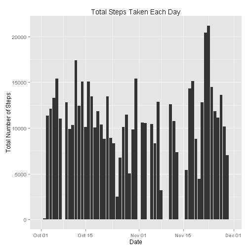
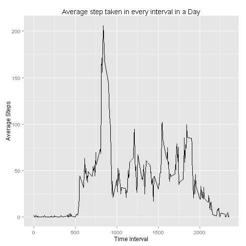
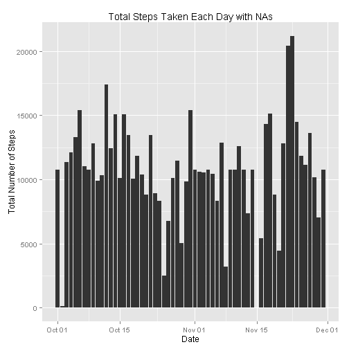
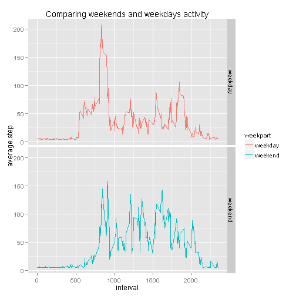

## Loading and preprocessing the data
To load the data to do the processing, we have to use unzip it first from respective directory and load into some variable.
Here we are storing this data in **accel**


```r
unzip('activity.zip')
accel <- read.csv('activity.csv', header=TRUE, sep = ',')
```

We observed that **date** variable in **accel** datasets is in facor format,so we are going to convert it into Date format.


```r
accel$date <- as.Date( accel$date, format = '%Y-%m-%d' )
str(accel$date)
```

```
##  Date[1:17568], format: "2012-10-01" "2012-10-01" "2012-10-01" "2012-10-01" ...
```


## What is mean total number of steps taken per day?
   
   We can start this process by loading require package into R workspace


```r
library(plyr)
library(ggplot2)
```

 Now we can start computing,
  First of all we will grouping required data according **date** and do the 
summation of number of steps on each day.


```r
steps.report <- ddply(accel,.(date),summarize,totl.steps = sum(steps,na.rm=T),mean.day = mean(steps,na.rm=T))
head(steps.report)
```

```
##         date totl.steps mean.day
## 1 2012-10-01          0      NaN
## 2 2012-10-02        126  0.43750
## 3 2012-10-03      11352 39.41667
## 4 2012-10-04      12116 42.06944
## 5 2012-10-05      13294 46.15972
## 6 2012-10-06      15420 53.54167
```

Now we can calculate mean of daily observation for overall time span. This is 
will use eventually and not now,when we need to fill **NAs** with mean value.


```r
mean.day <- mean(steps.report$mean.day,na.rm=T)
mean.day
```

```
## [1] 37.3826
```

Now we can plot this statistics on graph.
Below graph mentioned each day number of steps covered by user on every day.


```r
steps.plotting <- ggplot(steps.report,aes(date,totl.steps))
steps.plotting <- steps.plotting + geom_histogram(stat="identity") + ggtitle("Total Steps Taken Each Day") + xlab("Date") + ylab("Total Number of Steps")
steps.plotting
```

 

Obviously now we wants to see the mean and median steps taken by user in day wise withing given span of time


```r
summary(steps.report$totl.steps)
```

```
##    Min. 1st Qu.  Median    Mean 3rd Qu.    Max. 
##       0    6778   10400    9354   12810   21190
```

```r
summary(steps.report$totl.steps)["Mean"]
```

```
## Mean 
## 9354
```

```r
summary(steps.report$totl.steps)["Median"]
```

```
## Median 
##  10400
```


## What is the average daily activity pattern?

Now we need to prepare or compute daily activity on time interval basis,
So here is the computatin for that,
Kindly see that


```r
time.report <- ddply(accel,.(interval),summarise,average.steps = mean(steps,na.rm=T))
head(time.report)
```

```
##   interval average.steps
## 1        0     1.7169811
## 2        5     0.3396226
## 3       10     0.1320755
## 4       15     0.1509434
## 5       20     0.0754717
## 6       25     2.0943396
```

Its time to plot computed data on grpah with line method.


```r
time.plotting <- ggplot(time.report,aes(interval,average.steps))
time.plotting <- time.plotting + geom_line() + ggtitle("Average step taken in every interval in a Day") + xlab("Time Interval") + ylab("Average Steps")
time.plotting
```

 

But now we need to check at which interval where there is a peak in given oservation, and for that we can show by below computation,


```r
time.report[time.report$average.steps == max(time.report$average.steps),]
```

```
##     interval average.steps
## 104      835      206.1698
```


## Imputing missing values

Upto this we had deal with missing data consideration, but now we need to create new datasets with filling **NAs**
   But befor that we need to deal with other scenario, 
 Lets look at that,
 
1. We will calculate number of raw with **NAs**


```r
accel.with.na <- nrow(accel[is.na(accel),])
accel.with.na
```

```
## [1] 2304
```

2. We can fill **NAs* with mean which we calculate very early, if you remember, which is around 37. but for our sake of understand we can calculate it again from diffrent method.and compare it.


```r
mean.na <- mean(time.report$average.steps)
mean.na
```

```
## [1] 37.3826
```

```r
identical(mean.day,mean.na)
```

```
## [1] TRUE
```

3. Now its time to create new datasets, please look below computation,


```r
accel.without.na <- accel
accel.without.na[is.na(accel.without.na)] <- mean.na
```

4. Now we can recalculate total steps taken by user on each day with new datasets called as **accel.without.na**


```r
steps.report.na <- ddply(accel.without.na,.(date),summarize,totl.steps = sum(steps),mean.day = mean(steps,na.rm=T))
head(steps.report.na)
```

```
##         date totl.steps mean.day
## 1 2012-10-01   10766.19 37.38260
## 2 2012-10-02     126.00  0.43750
## 3 2012-10-03   11352.00 39.41667
## 4 2012-10-04   12116.00 42.06944
## 5 2012-10-05   13294.00 46.15972
## 6 2012-10-06   15420.00 53.54167
```

Now we can plot this data using histogram,


```r
steps.plotting.na <- ggplot(steps.report.na,aes(date,totl.steps))
steps.plotting.na <- steps.plotting.na + geom_histogram(stat="identity") + ggtitle("Total Steps Taken Each Day with NAs") + xlab("Date") + ylab("Total Number of Steps")
steps.plotting.na
```

 
 
Now we can check as we did early, to have a look at mean and median with new datasets.


```r
summary(steps.report.na$totl.steps)
```

```
##    Min. 1st Qu.  Median    Mean 3rd Qu.    Max. 
##      41    9819   10770   10770   12810   21190
```


## Are there differences in activity patterns between weekdays and weekends?

To see the diffrence in weekdays and weekends, we need to creat 2 diffrent factor vector.
But before that we need to add column with weekdays computation method.


```r
accel.without.na$day <- weekdays(accel.without.na$date)
w.day <- c('Monday', 'Tuesday', 'Wednesday', 'Thursday', 'Friday')
wend.day <- c('Saturday', 'Sunday')
accel.without.na$weekpart <- ifelse(accel.without.na$day %in% w.day, 'weekday', 'weekend')
head(accel.without.na)
```

```
##     steps       date interval    day weekpart
## 1 37.3826 2012-10-01        0 Monday  weekday
## 2 37.3826 2012-10-01        5 Monday  weekday
## 3 37.3826 2012-10-01       10 Monday  weekday
## 4 37.3826 2012-10-01       15 Monday  weekday
## 5 37.3826 2012-10-01       20 Monday  weekday
## 6 37.3826 2012-10-01       25 Monday  weekday
```

```r
table(accel.without.na$weekpart)
```

```
## 
## weekday weekend 
##   12960    4608
```

From above computation we can identified that we have created separate column for weekdays and weekends. Now its time to prepare graph for the same.
But one thing we need to keep in mind, 
As we need to incorporate weekends and weekdays in graph, we need to use facets mechanism here.
Have a loot at this method below,


```r
final.report <- ddply(accel.without.na ,.(interval,weekpart),summarize, average.step = mean(steps,na.rm=T))
final.plotting <- ggplot(final.report,aes(interval,average.step))
final.plotting <- final.plotting + geom_line(aes(colour=weekpart)) + facet_grid(weekpart ~ .) +ggtitle("Comparing weekends and weekdays activity")
final.plotting
```

 

 
##So we are done with this first assignement. Hope you like it.enjoy.


